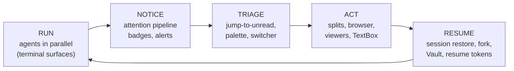
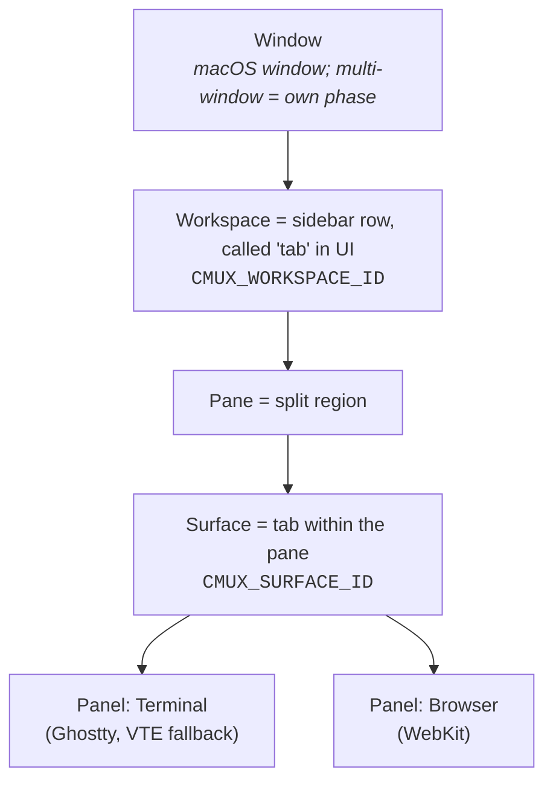
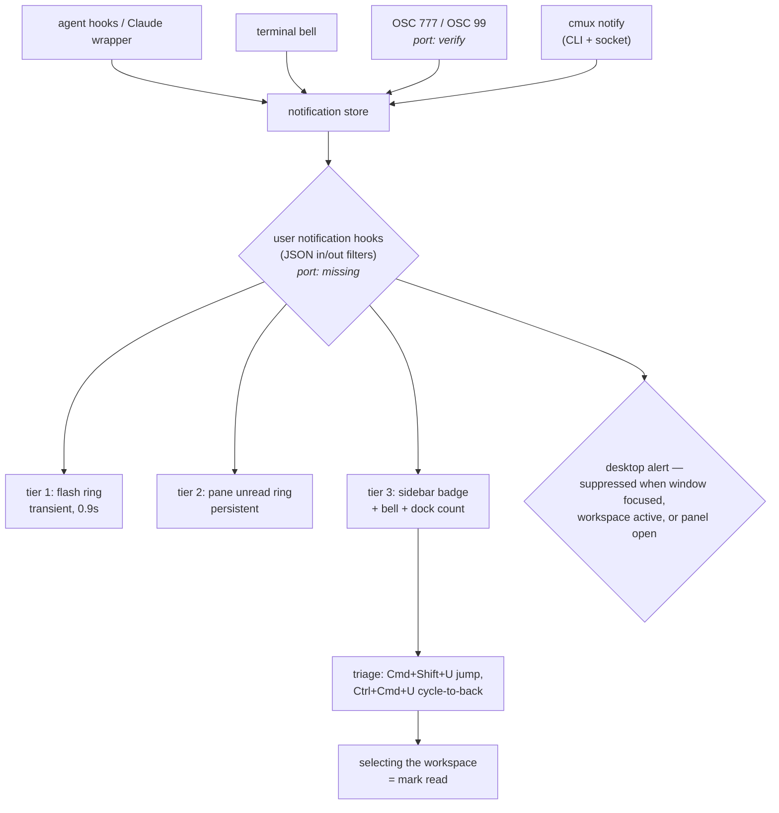
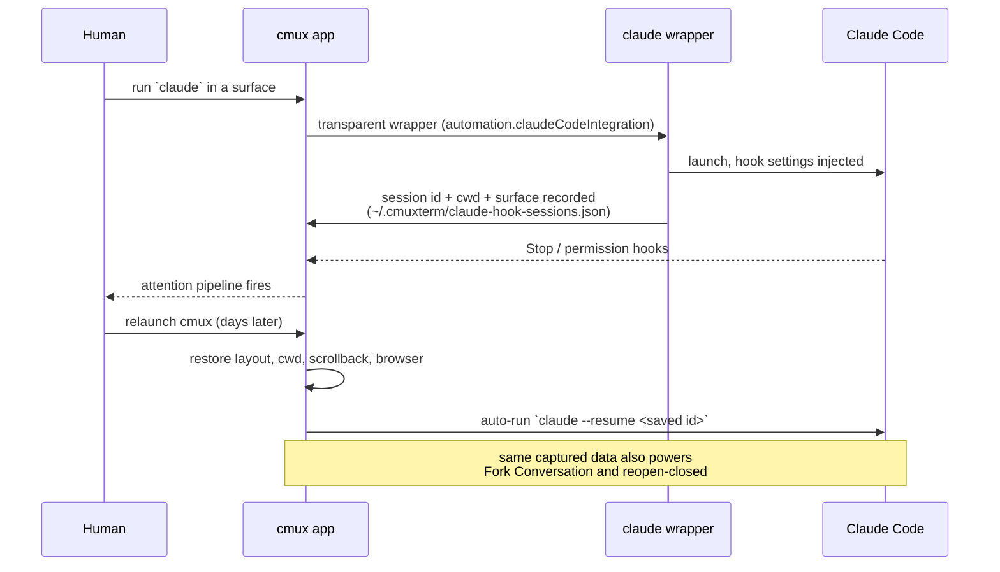
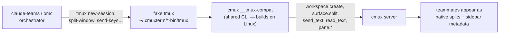
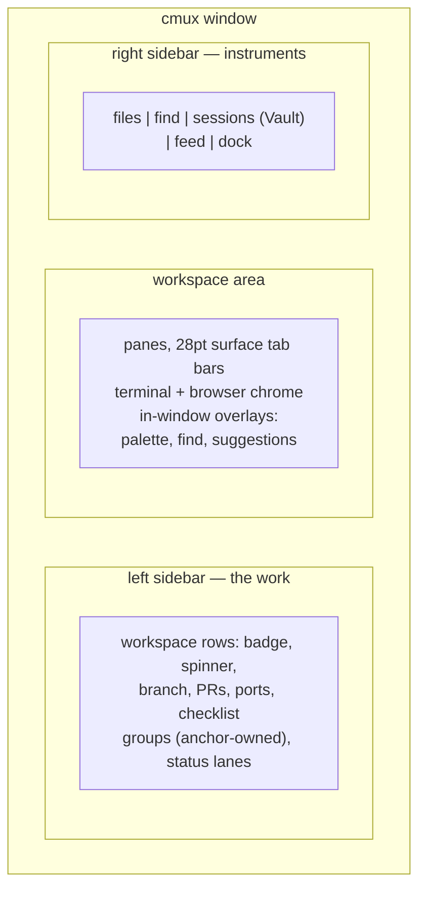
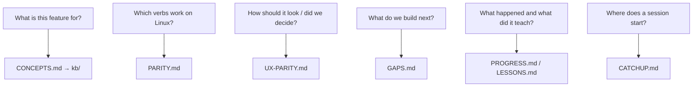

# cmux — the mental model on one page

The meta-summary of everything learned 2026-07-22 (docs crawl + dual UI
survey + kb/ deep dive). Details live in [CONCEPTS.md](CONCEPTS.md) and
[kb/](kb/INDEX.md); this page is the shape of the system. Update it
whenever those change in a way that redraws a picture.

## 1. What cmux is

> An agent supervision cockpit: a native terminal whose every feature
> serves the loop of running many AI coding agents in parallel without
> losing track of any of them.

The port lives this loop daily — it is developed inside itself.

## 2. The object hierarchy (the vocabulary)

Contract: UI text says **tab**, API says **workspace**; agents address
**surfaces**, never panels. The port implements this 1:1 (`cmux tree`).

## 3. The attention pipeline (how "notice" works)

One accent color, escalating persistence. The port has the store, the
badge (as a text dot), desktop alerts with the active-workspace rule,
and jump-to-unread; the ring tiers and hook filters are open rows.

## 4. Claude Code's lifecycle inside cmux (the load-bearing workflow)

**Wrapper, not hooks file** — that asymmetry (every other agent uses
`cmux hooks setup`) is the single most important implementation fact
for the port's resume work. This very session was resumed by
hand-carrying ids in text files; this diagram is the feature that
automates it.

## 5. Agent teams: the tmux shim

kb/tmux-compat.md verified all ~25 shim verbs against the shared CLI:
**every socket verb they need is green on the port.** One dogfood run
of `cmux claude-teams` decides the headline.

## 6. UI geography (where things live)

Principles that survive translation to GNOME: chrome lives *inside*
panes; workspaces only in the left sidebar; overlays instead of extra
windows; hover-revealed affordances; one attention color.
Port today: left sidebar (flat) + center; the right sidebar does not
exist yet as a concept.

## 7. The knowledge system (which doc answers what)

Rules that keep it true: same-commit updates, no gap closes without a
regression assertion, sweep after every merge, deviations are decisions.

## 8. Port heat map (2026-07-22)

| Loop stage | Substance | Port |
|---|---|---|
| Run | terminals (Ghostty default), splits, tabs, browser panes, profiles | ✅ strong |
| Notice | store, badges, desktop, bell, `notify`; rings/hooks/OSC open | 🟡 |
| Triage | jump-to-unread ✅; palette, switcher, focus history missing | 🟡 |
| Act | splits/tabs/browser ✅; viewers, TextBox, canvas missing | 🟡 |
| Resume | layout+scrollback ✅ (beyond macOS in places); agent resume, fork, Vault missing | 🟡 |
| Teams | shim verbs all green; end-to-end unverified | 🔎 |
