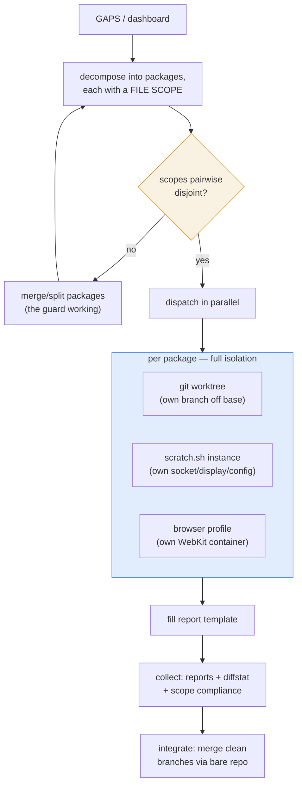

# Parallel-dogfood harness — many agents, disjoint packages, one clean git

A way to run several agents (claude-teams teammates, or spawned agents)
on **different** work packages at the same time, safely: each in its own
git worktree + its own scratch cmux instance + its own browser profile,
integrated through a local bare repo, without ever touching the human's
live checkout or origin.

Built and rehearsed 2026-07-23. Status: **mechanics proven on the
testbed** (`linux/scripts/pkg-harness.sh`); not yet run with real
teammates on real GAPS packages — that is the next step.

## Why it is safe — one property does the work

**Static scope-disjointness.** Every package declares the files it may
touch. `pkg-harness.sh check` refuses to dispatch if two scopes overlap,
so parallel branches merge conflict-free *by construction* — the guard is
at dispatch time, not merge time. `collect` additionally asserts each
branch changed only files inside its declared scope. An agent that strays
is caught mechanically.



## The isolation stack (every layer already existed)

| Layer | Primitive | What it isolates |
|---|---|---|
| git | `git worktree` + local **bare** integration repo | index, working tree, branch — no shared checkout |
| runtime | `scratch.sh <tag>` | cmux instance: own app-id, socket, display (:140-:159), hermetic config |
| research | `browser open --profile <tag>` / `--ephemeral` | cookies, cache, localStorage per agent |
| results | the report template | structured convergence |

The harness is *orchestration* over primitives we already shipped —
worktree isolation, the scratch wrapper, browser profiles, claude-teams.

## The tool

```sh
pkg-harness.sh init [--from <repo>]     # sandbox src + bare integration repo (default: synthetic testbed)
pkg-harness.sh add <id> --scope "…"     # worktree + branch off base
pkg-harness.sh check                    # assert scopes disjoint (refuses overlap)
pkg-harness.sh list | collect           # status · reports + diffstat + scope compliance
pkg-harness.sh integrate                # merge clean branches into base via the bare repo
pkg-harness.sh verify-runtime <id> …    # prove per-agent instance + profile isolation
pkg-harness.sh teardown                 # worktrees + instances + profiles + sandbox
```

Sandbox root: `$CMUX_PKG_SANDBOX` (default `~/.local/state/cmux/pkg-sandbox`).
Nothing runs in `~/cmux`'s git.

## Rehearsal result (2026-07-23)

Full dance on the synthetic port-shaped testbed, every step green:
init → add 3 disjoint packages (browser / keyboard / sidebar) → **check
passed** (disjoint) → simulate in-scope work → **collect** (all
scope-compliant) → **integrate** (3 branches merged clean via the bare
repo) → **negative test**: a 4th package overlapping `sidebar`'s scope
was **refused by check** (exit 1) → **verify-runtime**: two agents got
distinct sockets + displays (:140/:141) and distinct profiles, no
collision → teardown left nothing behind.

## Running it for real (the intended flow with claude-teams)

1. Pick a **disjoint cluster** from the dashboard. Good v1 sets (near-zero
   file overlap): **browser** (ephemeral/download/viewport), **keyboard**
   (rebinding + muscle-memory batch), **teams-siblings** (codex/omc smoke,
   tests only), **sidebar-ui** (notification cards, tab icons). The one
   hotspot is `CmuxApp.swift` (keyboard + sidebar both reach it) — keep it
   in one package per batch, or split its concerns first.
2. `init --from ~/cmux`, then `add` each package with its real file scope;
   `check`.
3. Spawn one claude-teams teammate per package (native split), task =
   scoped: "**Step 1: record your pane —
   `echo \"$CMUX_SURFACE_ID $CMUX_WORKSPACE_ID\" > <sandbox>/.pkg/<id>/surface`**
   (so the orchestrator can find you by name); your worktree is <path>;
   touch only <scope>; test via `scratch.sh <id>`; research via
   `browser --profile <id>`; fill `pkg-report-template.md` (every field —
   Findings/Product-bugs/Harness-friction carry the work that reports
   otherwise lose); follow the same-commit docs rule."
4. `collect` → review reports + branch diffs → `integrate` clean ones →
   the human promotes the integrated base to origin when satisfied
   (nothing reaches origin automatically).

**Visibility (ADR-0009).** Reports lose what the pane holds — the best
finds of batches 1–2 came from reading an agent's pane, not its report.
So each agent records its own `$CMUX_SURFACE_ID` (step 1 above), and the
harness reads it back:

```sh
pkg-harness panes            # the name → pane registry
pkg-harness review <id>      # read that agent's live screen by name
```

The **norm**: when a report is *surprising* (a bug, a blocker, a premise
correction), `review <id>` the pane before acting — the full context is
there, the report is a summary. And keep the report frame tight but
complete; a finding that isn't in a field is invisible to the main
session.

**One writer per worktree** stays the rule: the orchestrator does not
edit a teammate's worktree while it works. New GAPS a teammate discovers
go in its report, then into GAPS / the survey ledger at integration.

## Real-run refinements (discovered scoping the first batch, 2026-07-23)

Two things the synthetic testbed couldn't show — both reshape a real
batch (the "unproven" risk ADR-0001 named):

1. **Shared registration/tracker files are integrator-owned, not
   teammate-owned.** Two code packages would both touch `run-all.sh` (test
   registration) and the shared trackers (`PARITY.md`, `GAPS.md`,
   `PROGRESS.md`) — a guaranteed overlap. Rule: teammates touch only their
   subsystem files **plus their own NEW test file** (a fresh path never
   conflicts); the integrator does the `run-all.sh` registration and the
   tracker updates at merge time, from each report. This keeps teammate
   scopes genuinely disjoint. Verb-dispatch files (`ControlProtocol.swift`)
   can be in *one* package's exclusive scope when only that package needs
   them.

2. **Build cost is asymmetric — but solved.** A worktree's `linux/.build`
   and the ghostty shim don't exist fresh. A naive code package would pay a
   full submodule-init + ghostty-build + `swift build` (minutes); a
   tests/CLI-only package (teams-siblings) needs no build at all (it drives
   the main binary via `scratch.sh`). The code-package cost is removed by
   **sharing** what's identical across worktrees on the same commit
   (`pkg-harness.sh add <id> --build`):
   - **shim** — symlink `<wt>/ghostty/zig-out` → the main checkout's
     `zig-out` (no per-worktree zig build).
   - **`.build`** — a **btrfs reflink** copy (`cp --reflink`, ~1s,
     copy-on-write): the worktree's build writes break extent sharing, so
     main's `.build` is never touched, and the first build is
     **incremental (~30s)** instead of from-scratch.

   Measured 2026-07-23: seed 0.9s, first incremental build 29s, worktree
   binary independent and linking the shared shim. So code packages *do*
   parallelize cheaply — the constraint is btrfs (or any reflink/CoW fs)
   for the instant-safe seed; without it, `--reflink=auto` falls back to a
   ~2s plain copy, still far cheaper than a full rebuild.

3. **Worktree lifecycle follows the AGENT, not the merge (fixed after
   batch 1).** The first batch's integrator (me) ran `teardown` right after
   integrating — and reaped the worktrees out from under still-live agents,
   so a teammate asked to do more had no working dir. The teammate caught
   it from the inside. The fix, both conceptual and enforced:
   - **`integrate` is non-destructive** — it merges the *pushed* branch from
     the bare repo and never touches a worktree. Safe to run anytime;
     agents keep working after it.
   - **`release <id>`** reaps one package's worktree when *that agent is
     dismissed* — the merge is already safe in the bare repo, so the
     worktree's only remaining job is to serve the still-live agent.
   - **`teardown` refuses while packages remain** (run it only when the
     whole batch is wound down) unless `--force`.

   The mental-model correction: **teammates are persistent collaborators,
   not fire-and-forget jobs.** They can be re-tasked, answer questions, and
   spot harness flaws from inside a batch — so the harness lifecycle must
   track the agent's lifetime, not the moment its branch merges.
