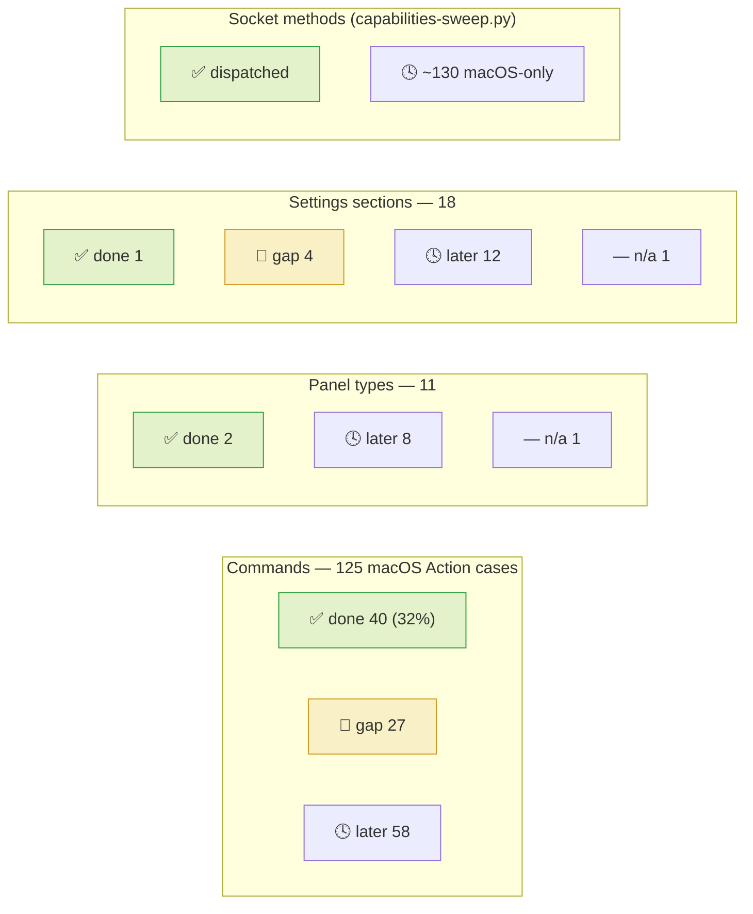
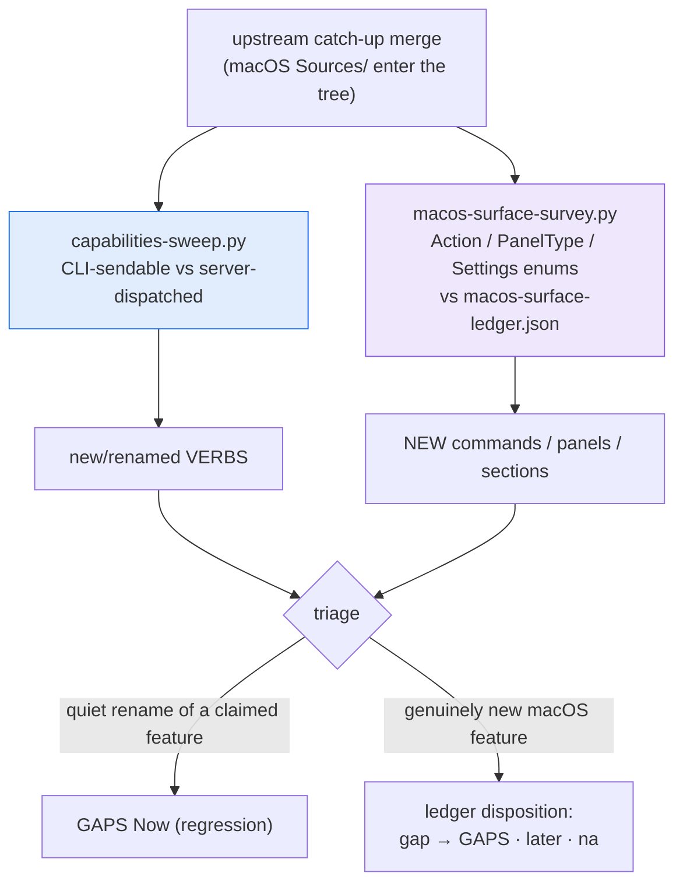

# Parity dashboard — the board of boards

The roll-up: how much of macOS cmux the port covers, how we *discover*
what's left as macOS keeps moving, and where the detail lives. This page
is the human view; the machine-adjacent truth is the per-item ledgers and
the two survey tools, which a re-run keeps honest.

**This is not a new backlog.** It indexes the existing focused ledgers
(each with one responsibility and its own update trigger) and adds the
one thing they lacked: a coverage picture and a repeatable discovery
cadence. Don't move item detail here — it rots. Add a gap to
[GAPS.md](GAPS.md), flip state in [PARITY.md](PARITY.md); this page
re-derives from the tools.

## Coverage at a glance

Snapshot 2026-07-23 from `linux/scripts/macos-surface-survey.py`
(re-run it — these numbers are generated, not hand-kept):



**Read it as:** *done* = bound/implemented on the port; *gap* = real,
actionable, belongs in GAPS; *later* = a macOS family we've deliberately
deferred (canvas, right sidebar, diff viewer, workspace groups,
multi-window…); *n/a* = doesn't apply. The big "later" blocks are the
macOS breadth the port hasn't claimed — known, not forgotten.

## The discovery cadence — how we find what macOS has that we don't

The hard part isn't the documents; it's noticing new macOS surface *over
time* (existing features we missed, and future upstream updates). Two
automated tripwires, both run **after every upstream merge**, both feed
GAPS:



- **capabilities-sweep.py** — the verb tripwire. Catches the CLI quietly
  changing what it dials (how `cmux notify` and `list-windows` broke).
  Since 2026-07-24 it also self-checks the server's advertised
  `system.capabilities` list against the dispatcher (both directions)
  and exits 1 on drift — the hand-maintained list had gone 16 methods
  stale, under-telling introspecting agents what the port can do.
- **macos-surface-survey.py** — the *app* tripwire (new 2026-07-23).
  Extracts macOS's enumerable app surface — the 125-case command
  registry, panel types, settings sections — and diffs it against the
  reviewed `macos-surface-ledger.json`. A future merge that adds a
  command surfaces it as `NEW (triage)`; `--check` exits nonzero so it
  can gate. The ledger records each item's disposition so re-runs stay
  quiet until macOS actually changes.

One-shot surveys still have their place (the UX code survey, the docs
crawl) — but the two tools above are what make discovery *repeatable*.

## Where the detail lives (single-responsibility ledgers)

| Ledger | Owns | Update trigger |
|---|---|---|
| [PARITY.md](PARITY.md) | per-verb/feature ✅/❌ **state** | same commit as any feature change |
| [GAPS.md](GAPS.md) | the actionable **backlog** + effort | discover → fix lifecycle |
| [UX-PARITY.md](UX-PARITY.md) | **look & feel** deltas + decisions | any visible UI change |
| [FEATURES.md](FEATURES.md) | **user-facing** "what it does today" | shipped features |
| [CONCEPTS.md](CONCEPTS.md) · [kb/](kb/INDEX.md) | **intent** — what each feature is for | docs re-crawl |
| [wiring/](wiring/index.md) | **internal wiring** atlas (diagrams) | subsystem changes |
| `macos-surface-ledger.json` | reviewed **disposition** of macOS's enumerable surface | survey triage |

Feed those; this dashboard is the index over them.

## Refreshing this page

```sh
python3 linux/scripts/macos-surface-survey.py          # coverage numbers
python3 linux/scripts/capabilities-sweep.py            # verb drift
```

Update the snapshot numbers and the diagram when they move materially
(not every commit — the tools are the live truth). The ledger dispositions
are seeded by name+known-state; refine an area's entries when you next
work in it, and promote `later`→`gap` when a family becomes real work.
