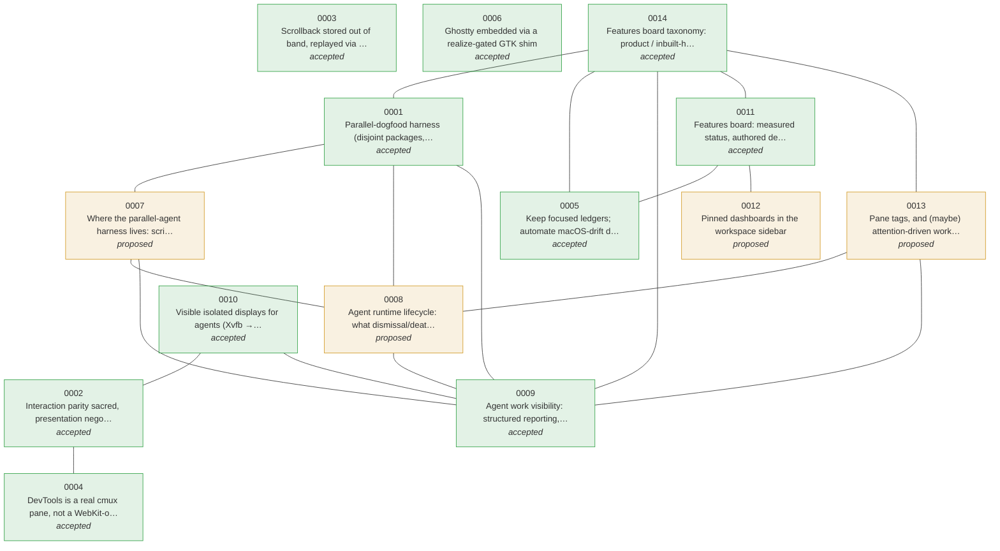

# ADR atlas — the decision landscape

Generated by `linux/scripts/adr-atlas-graph.py` from the ADR files — re-run it when you add or re-status an ADR. Nodes are coloured by status; edges are cross-references between records.

| # | Decision | Status |
|---|---|---|
| [0001](0001-parallel-dogfood-harness.md) | Parallel-dogfood harness (disjoint packages, worktree + scratch + profile) | accepted |
| [0002](0002-interaction-parity-sacred.md) | Interaction parity sacred, presentation negotiable | accepted |
| [0003](0003-out-of-band-scrollback.md) | Scrollback stored out of band, replayed via inject_output | accepted |
| [0004](0004-devtools-as-pane.md) | DevTools is a real cmux pane, not a WebKit-owned dock | accepted |
| [0005](0005-focused-ledgers-and-discovery-cadence.md) | Keep focused ledgers; automate macOS-drift discovery | accepted |
| [0006](0006-ghostty-embed-strategy.md) | Ghostty embedded via a realize-gated GTK shim | accepted |
| [0007](0007-harness-layer-and-extensibility.md) | Where the parallel-agent harness lives: scripts, skill, command, or plugin | proposed |
| [0008](0008-agent-runtime-lifecycle.md) | Agent runtime lifecycle: what dismissal/death does to an agent's surfaces | proposed |
| [0009](0009-agent-work-visibility.md) | Agent work visibility: structured reporting, pane-review, and name↔pane mapping | accepted |
| [0010](0010-visible-isolated-displays-for-agents.md) | Visible isolated displays for agents (Xvfb → a cmux pane) | accepted |
| [0011](0011-features-board-generated-not-curated.md) | Features board: measured status, authored descriptions | accepted |
| [0012](0012-pinned-dashboards-in-sidebar.md) | Pinned dashboards in the workspace sidebar | proposed |
| [0013](0013-pane-tags-and-attention-workflows.md) | Pane tags, and (maybe) attention-driven workflows over them | proposed |
| [0014](0014-features-board-taxonomy.md) | Features board taxonomy: product / inbuilt-harness / meta-harness | accepted |

Legend: 🟩 accepted · 🟨 proposed · 🟥 rejected · ⬜ superseded. Full record behind each node — pick it from the sidebar.
