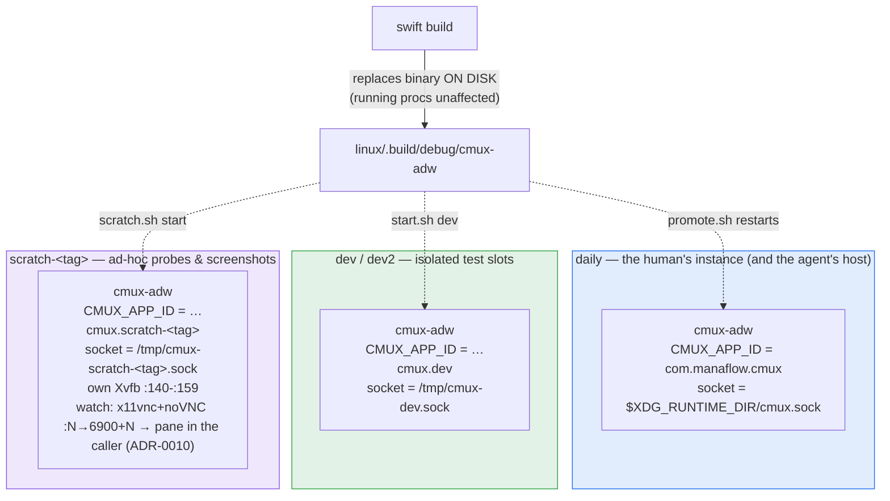
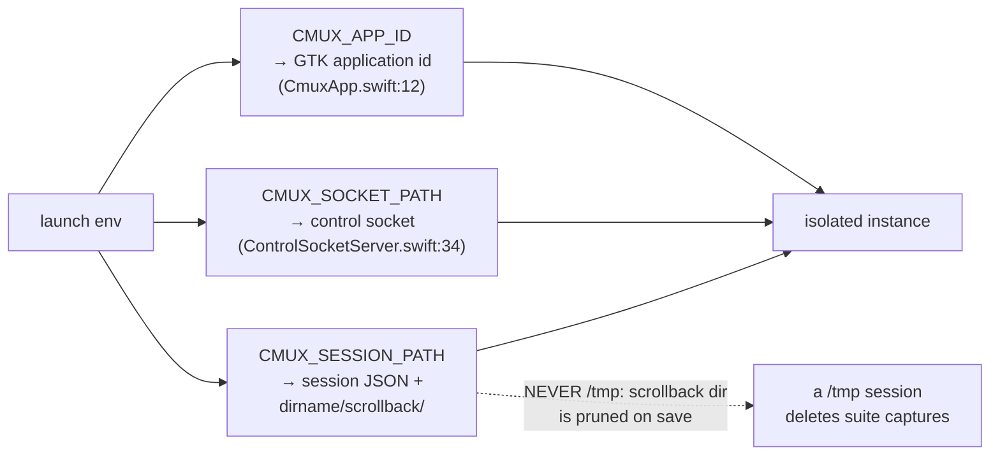
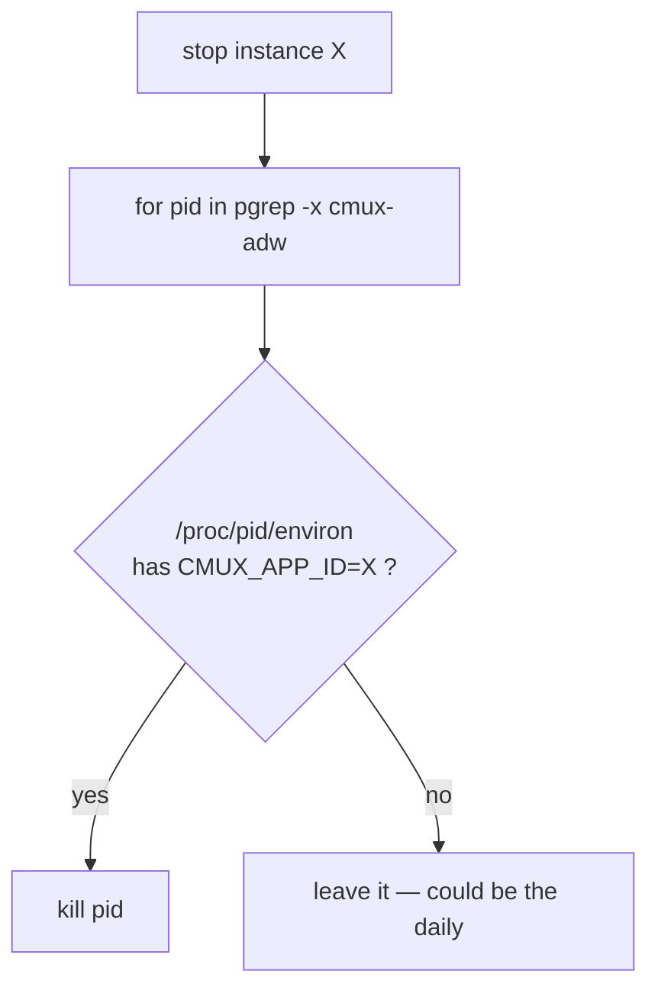

# ② Instance topology & sockets

How many cmux processes run, how they stay isolated, and which socket
each answers on. This is the safety model the whole self-hosting
workflow rests on: *the agent develops the port from inside a running
instance of it*, so "which process am I talking to" is never academic.

## The processes

**Prime directive:** never kill the daily — the agent's shell is a pane
of it and dies with it. `swift build` is always safe (it only rewrites
the on-disk binary); the running process keeps its old code until an
approved restart.

## Identity comes from the environment

Three env vars make an instance a distinct universe. Set them and you
get a parallel cmux; forget one and you collide with the daily.

Socket resolution order (`ControlSocketServer.defaultSocketPath`):
`CMUX_SOCKET_PATH` override → `$XDG_RUNTIME_DIR/cmux.sock` → `/tmp/cmux-$(uid).sock`.
macOS uses a fixed `/tmp/cmux.sock`; the port follows XDG instead.

## Who may kill whom

The one rule that keeps the self-hosting loop safe: **kill strictly by
`CMUX_APP_ID` match in `/proc/<pid>/environ`, never by process name.**
`pkill -f cmux-adw` also matches the agent's own shell command line —
it has bitten twice.

Every wrapper encodes this: `scratch.sh stop`, `promote.sh`, the test
harness teardown, and the manual `for pid in $(pgrep -x cmux-adw)` loops
in the briefing all match on the app-id, never the name.

## Terminal panes inherit the socket

A shell spawned into any surface gets `CMUX_SOCKET_PATH`,
`CMUX_WORKSPACE_ID`, and `CMUX_SURFACE_ID` in its environment
(`TerminalSurfaces.swift:84`, `GhosttySurfaces.swift:74`) — so a bare
`cmux` command inside a pane targets *its own* instance and identifies
*its own* pane, with no flags. That inheritance is exactly what the
tmux shim rides on (see ③).
