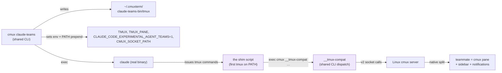
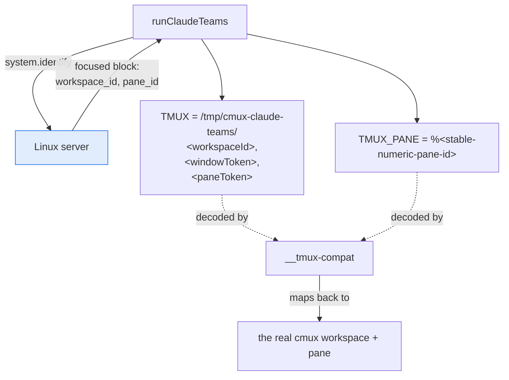
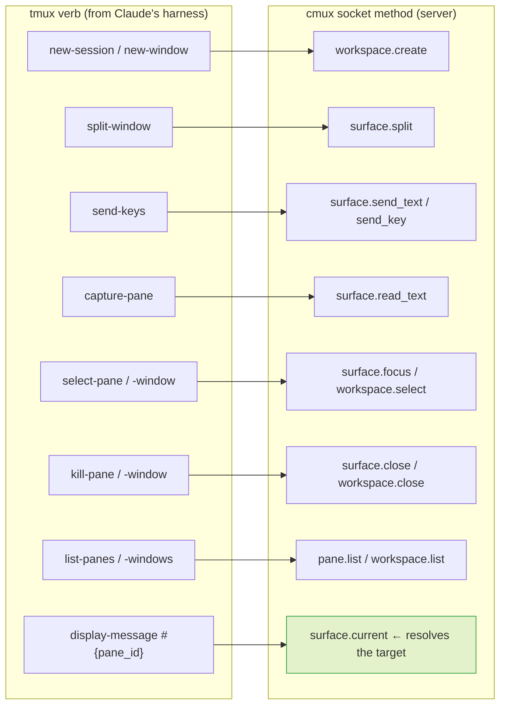
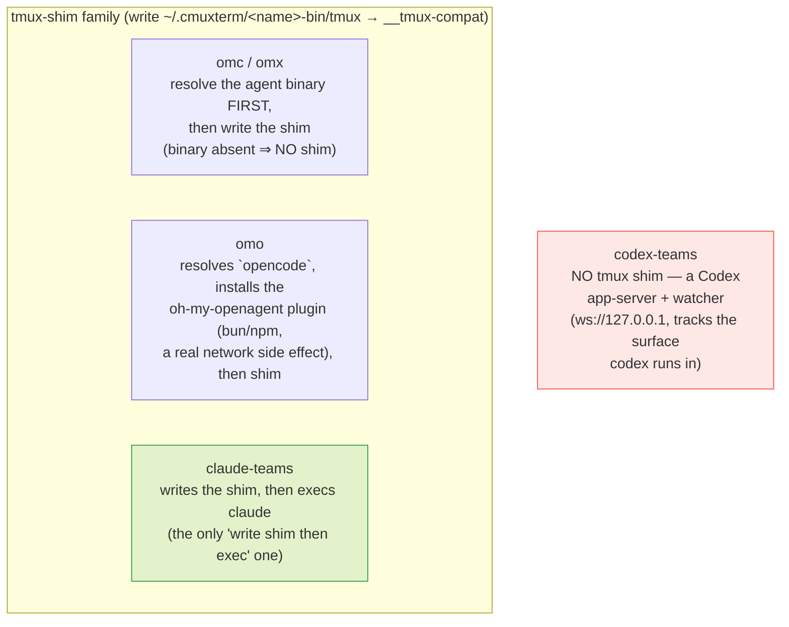

# ③ claude-teams / the tmux shim

The wiring that prompted this atlas. `cmux claude-teams` makes Claude
Code believe it is inside tmux, so when it spawns teammate agents they
land as **native cmux splits** instead of tmux panes. Verified
end-to-end on the port 2026-07-22; this session runs inside it.

## The redirect chain

The shim itself is three lines — a `tmux` that `exec`s
`cmux __tmux-compat "$@"`. Prepending its directory to `PATH` means
Claude finds it before any real tmux. **Trap:** the launcher OWNS that
directory; hand-editing the shim breaks the next launch with a Cocoa
"file exists" error — delete the dir and let it regenerate.

## The fake tmux identity

The launcher builds a `TMUX` value and `TMUX_PANE` that *encode the
current cmux location*, resolved from the server at launch:

**This is the bit the port was missing.** `system.identify` on Linux
returned only flat fields — no `focused` block — so the launcher fell
back to a `default,0,0` fake env, and every teammate spawn died with
*"Could not determine current tmux pane/window."* Adding the `focused`
block (macOS's exact envelope) fixed it. See PROGRESS 2026-07-22 "late".

## What the shim translates

`__tmux-compat` handles ~25 tmux verbs; each maps to a socket method the
port already implements. The load-bearing ones:

`surface.current` (green) is the other verb the port had to add: the
shim resolves *every* list/target/send through it, so its absence
silently broke the whole read half while splits still worked. Guarded
now by `linux/tests/tmux-compat-smoke.sh`.

## Sibling launchers — NOT homogeneous (corrected 2026-07-23, batch 1)

The four "sibling" launchers are **not** one uniform shim family. The
parallel-dogfood `teams-siblings` package (verified against `CLI/cmux.swift`)
found they differ in *how* they integrate — only three use the tmux shim,
and they don't even write it the same way:

- **claude-teams** — writes the shim, then execs the agent (verified
  end-to-end; ✅).
- **omc / omx** — resolve the agent binary *before* writing the shim, so
  an absent binary exits early with no shim written. Same `__tmux-compat`
  substrate once the shim exists.
- **omo** — resolves `opencode` (not a literal `omo`) and installs its
  oh-my-openagent plugin (a real bun/npm side effect) *before* the shim.
- **codex-teams** — writes **no** tmux shim at all; it runs a Codex
  **app-server + watcher** over a loopback WebSocket and tracks the pane
  codex runs in that way. A fundamentally different integration.

`teams-siblings-smoke.sh` verifies the launcher/shim setup path (14
assertions); the real "teammate becomes a split" leg is skipped because
the agent binaries aren't installed here (see GAPS).
