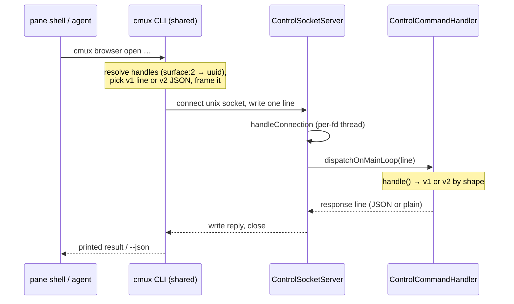
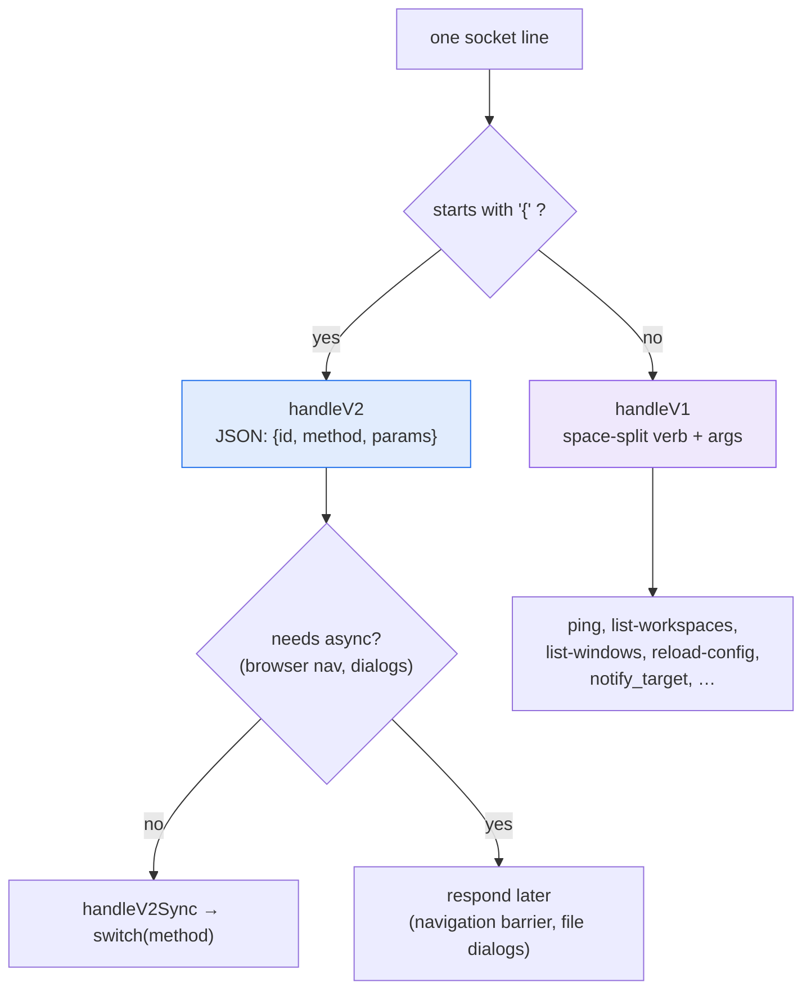
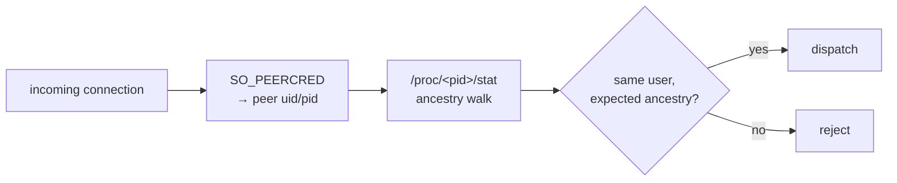
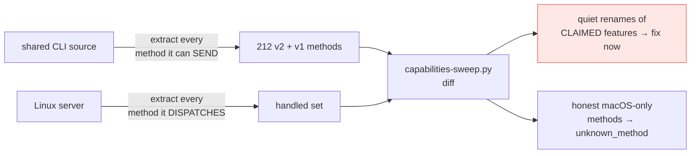

# ④ Control protocol — CLI ↔ socket ↔ dispatch

Everything an agent, shortcut, or the human's UI does eventually becomes
a socket message the server dispatches. The CLI is **shared with macOS**;
only the server side is Linux code, and the wire format is identical — so
`cmux <anything>` behaves the same on both platforms.

## The round trip

The server reads whole lines on a per-connection thread
(`ControlSocketServer.handleConnection`) but hops every command onto the
**GTK main loop** (`dispatchOnMainLoop`) before touching the model —
the model and all widgets are main-loop-only.

## Two protocol generations

**v2** (JSON) is the modern surface — `system.*`, `surface.*`, `pane.*`,
`browser.*`, `notification.*`, `workspace.*`. **v1** (plain lines) is the
legacy surface the CLI still uses for a handful of verbs and the tmux
shim's fast paths. The capabilities sweep scans **both** — a rename can
hide in either generation (that is how `cmux notify` and `list-windows`
silently broke after the upstream merge).

## Peer credentials (the security boundary)

The port re-implements macOS's `LOCAL_PEERCRED`/sysctl boundary with
Linux `SO_PEERCRED` + `/proc` ancestry — same guarantee (only the
owning user's processes drive the socket), different syscalls. This is
in the shared CLI's Linux compat layer, ported during the catch-up merge.

## The capabilities sweep (a standing tripwire)

Run after every upstream merge (`linux/scripts/capabilities-sweep.py`).
The red class — the CLI quietly changing what it dials while both ends
look healthy — now has a permanent guard.
