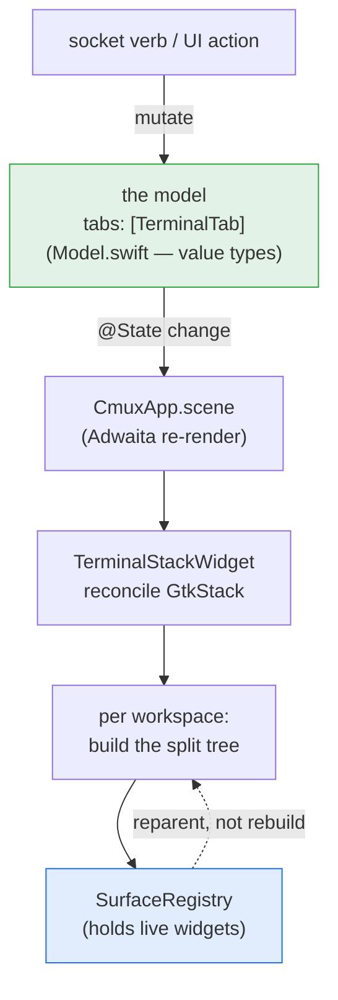
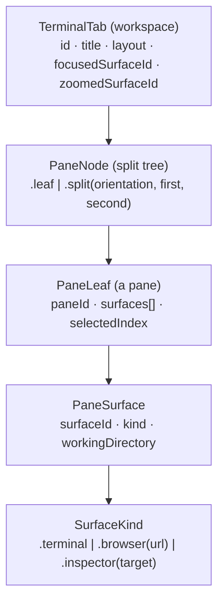
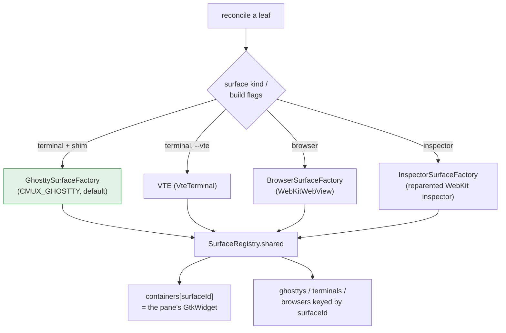
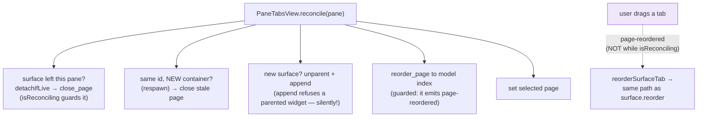

# ⑤ Model → view → surfaces

The port is **model-driven**: socket verbs and UI actions mutate a plain
value model, and an Adwaita scene re-renders the widget tree to match.
Live terminals and web views are *reparented, never recreated* — the
registry holds them across every re-render.

## The core loop

**Rule:** the model is the truth; the widget tree is a projection. A verb
never pokes a widget directly — it changes the model and lets the scene
reconcile. That is what keeps UI and socket callers from ever disagreeing
about, say, which surface a pane shows.

## The object model

Mirrors macOS's Bonsplit layout tree and `SessionWorkspaceLayoutSnapshot`.
A pane holds *several* surfaces behind a tab strip (popups land as tabs,
not forced splits) — the single-surface accessors (`leaf.surfaceId`,
`leaf.kind`) mean "the surface this pane is currently showing".

## Four backends, one registry

The registry is the single home for live widgets. `doctorReport`
(`debug.surfaces`) reads it — backend, realized/mapped, container
refcount, parent type, and now **css_classes** (so the attention system
is assertable). Everything downstream keys off `surfaceId`.

## PaneTabs reconcile — the tricky part

Two subtleties the code comments flag: closing a page *destroys* its
child (kills a Ghostty shell), so a moving surface is **detached** first,
not closed; and `reorder_page`/`close_page` both emit signals that would
echo back into the handlers — hence the `isReconciling` flag around every
programmatic mutation.
