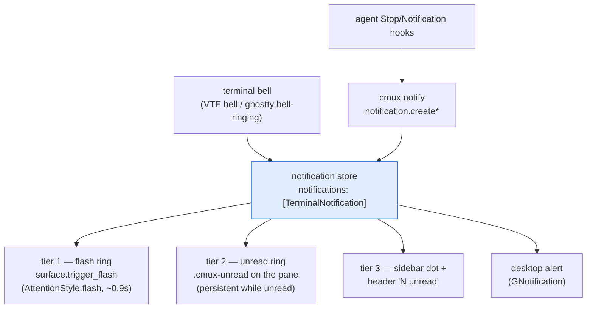
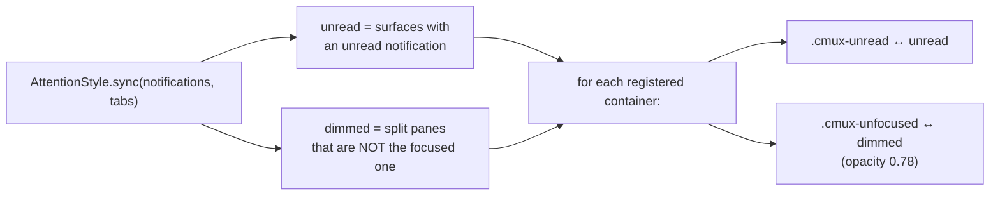
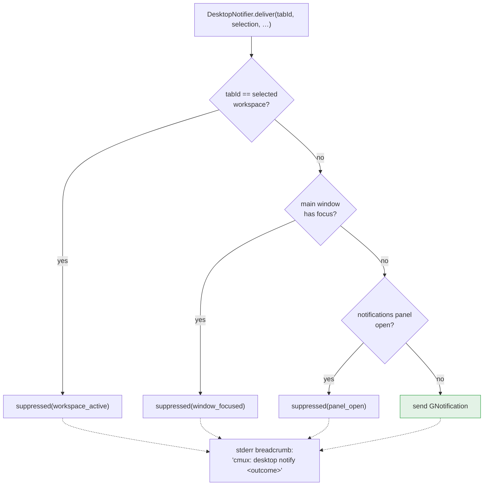

# ⑥ Attention pipeline

How "an agent needs you" travels from a source to a pixel. One accent
color, three escalating tiers, plus desktop delivery gated by a
suppression funnel — mirroring macOS's contract on GNOME.

## Sources → store → tiers

Tiers 1–2 are **CSS classes** on the pane container, installed once as an
app-level provider (`AttentionStyle`) using `@accent_bg_color` — so the
rings follow the user's GNOME accent, the recorded deviation from macOS's
fixed blue. Because they are widget-class writes, `AttentionStyle.sync`
runs from the scene body every render and covers *every* mutation path
(bell, notify, mark-read, dismiss, clear, focus moves) in one place.

## The dimming + ring sync (one pass)

Split dimming is macOS's `showsInactiveOverlay: isSplit && !isFocused` —
a workspace with one pane dims nothing. Both are assertable through
`debug.surfaces` css_classes (the suites drive real state and read the
classes back, no screenshots needed).

## The desktop suppression funnel

All three documented rules live in **one** decision path
(`DesktopNotifier.deliver`), replacing three drift-prone inline copies of
the first rule. The breadcrumb is deliberate: the suite asserts the
funnel ran without observing the desktop. Withdrawal
(`g_application_withdraw_notification`) fires when the notification is
read or its workspace closes.

## Triage

Selecting a workspace marks its notifications read (read = viewed, a
documented behavior). **Ctrl+Shift+U** jumps to the first workspace with
attention; the notifications page (sidebar swap) lists them newest-first
with jump-on-click.
