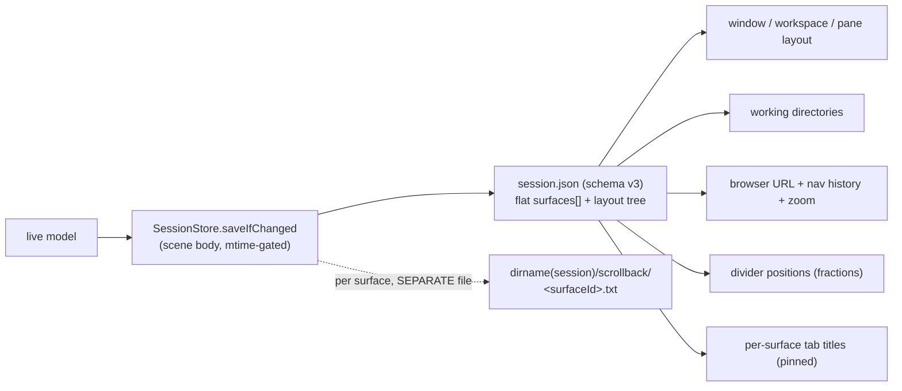
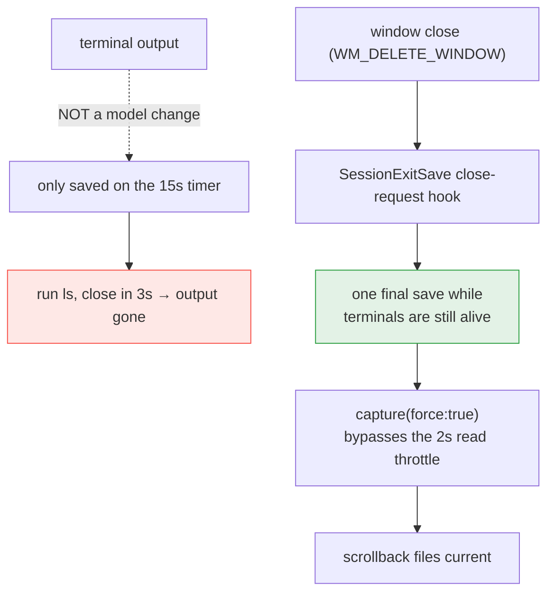
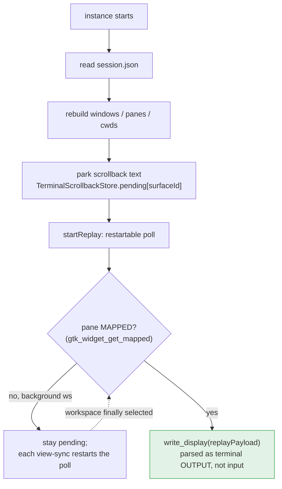

# ⑦ Session & scrollback

What survives a restart, and the two-file design that makes "keep all
scrollback" affordable. The port deliberately diverges from macOS here —
WebKitGTK's native session blob and out-of-band scrollback beat the
mac's shadow-stack emulation.

## What persists

Scrollback lives **out of band** — one file per surface next to the
session — because the session JSON is rewritten on every model change;
inline text made every line of terminal output rewrite the whole
document (327 KB per save in a real dev session). Out of band, the limit
is configurable up to unlimited (`CMUX_SCROLLBACK_LIMIT=0`).

## The exit save (why output isn't lost)

The close must be the *polite* one — `xdotool windowclose` calls
XDestroyWindow and bypasses `close-request`, which cost a debugging
round and is why the suite uses a real `WM_DELETE_WINDOW` C helper.

## Restore & replay

Two lessons baked in: replay is gated on the pane being **mapped** (an
unmapped background pane's write silently succeeds into a terminal that
has not started, losing the text), and `replayPayload` normalizes
**LF→CRLF** — `read_text` returns bare-LF rows and `inject_output` feeds
the parser directly, where LF means "down a row" without a return, so
un-normalized text staircases off to the right. macOS gets the CR free
via the pty's ONLCR discipline; bypassing the pty is the port's speed,
and this is the bill.

Ghostty and VTE both capture/replay now (VTE via
`get_text_range_format` + `feed`); the CRLF normalization is
backend-agnostic in `replayPayload`, so the staircase lesson carried
over for free.
