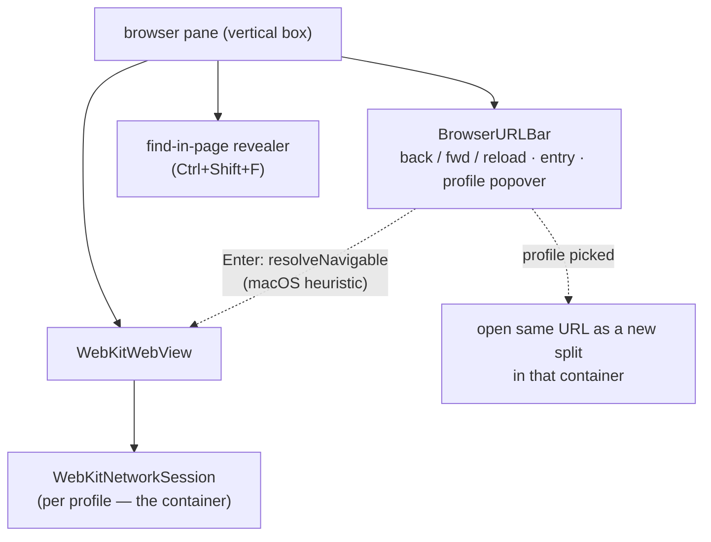
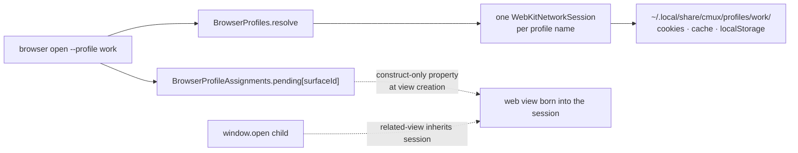
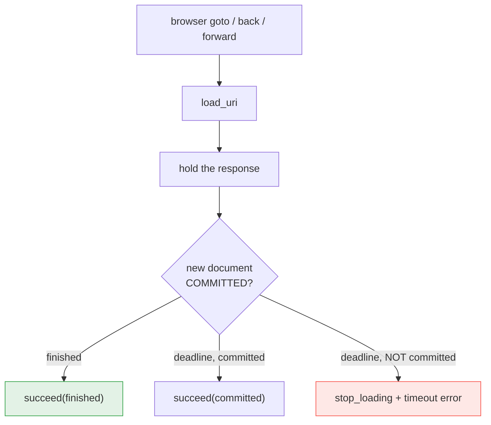

# ⑧ Browser stack

WebKitGTK panes with a full automation surface, container profiles, and
an inspector-as-pane. The automation half is what a dogfood agent drives;
the human gets the URL bar and profile popover.

## Anatomy of a browser pane

The URL heuristic is macOS's, ported deliberately: `localhost:3000`
before generic parsing, spaces → search, bare domain → https, else the
search engine (`CMUX_SEARCH_URL`). The profile popover switches by
*split* because `network-session` is construct-only — a live view cannot
change containers in place.

## Container profiles

The sharing *is* the container: all panes with the same profile see each
other's logins; other profiles see none of it. Default profile = WebKit's
default session, so pre-profile browsing state stays put. Popups inherit
the opener's container automatically (related-view).

## The navigation barrier (agent correctness)

Why it matters: without the barrier, `goto` returned OK while the
*previous* page still answered every follow-up — an agent scrapes the
wrong page and never sees an error. The timeout branch **stops the load**
(the 2026-07-23 fix) so a failed navigation can't commit minutes later
and yank the pane. Both directions are guarded by
`browser-navigation-smoke.sh` with a local tarpit.

## Inspector as a real pane

```mermaid
flowchart LR
    inspect["browser inspect / devtools"] --> emptybox["create empty container pane"]
    emptybox --> register["registered BEFORE the split lands<br/>(InspectorAdoption.pending)"]
    register --> show["webkit_web_inspector_show + attach"]
    show --> signal["attach / open-window signal"]
    signal --> reparent["reparent the inspector's<br/>WebKitWebViewBase into our pane"]
    console["devtools console"] -.->|"reuse if present, else split"| inspect

    style reparent fill:#1f6feb22,stroke:#1f6feb
```

Unlike macOS (which lets WebKit own the dock state), the port makes
DevTools a **real cmux pane** — tabs, splits, socket-drivable. The
inspector widget is a `WebKitWebViewBase`, *not* a `WebKitWebView`, and
WebKit hands it out only inside the `attach` handler — hence the
register-first, show-then-reparent dance. The JS console reveals the same
pane and focuses it (no public WebKitGTK tab-flip exists).
