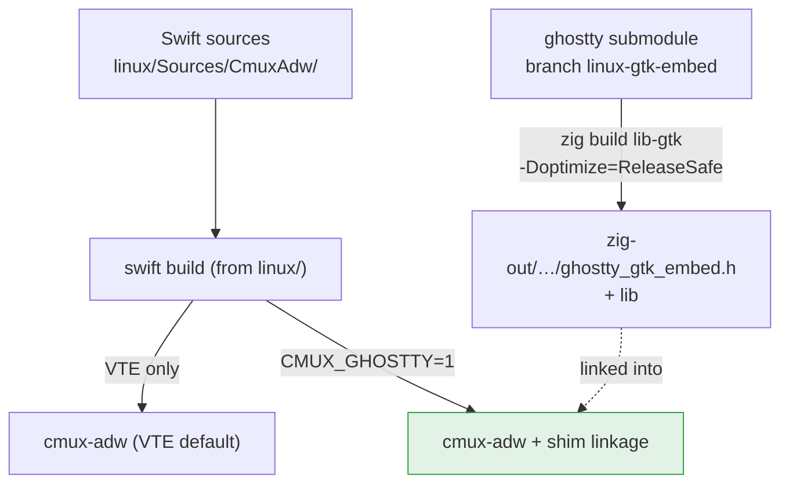
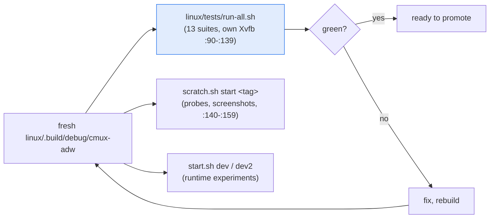
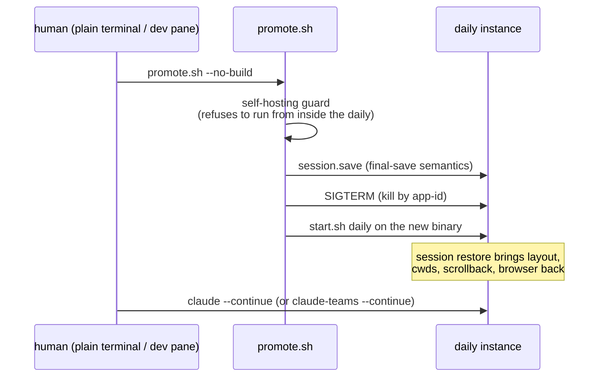
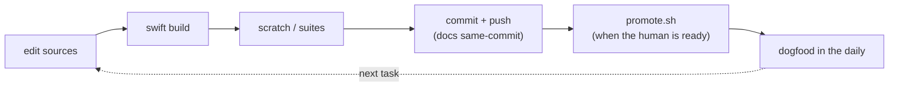

# ⑨ Build → scratch → promote

The dev loop that lets the agent develop the port from inside a running
copy of it, without ever risking the human's daily instance. Three build
artifacts, three instance slots, one human-approved checkpoint.

## The two binaries

`swift build` is **always safe** — it rewrites the on-disk binary; every
running instance keeps its old code until an approved restart. ReleaseSafe
is the standard shim mode (Debug scrolls sluggishly; ReleaseFast SEGVs in
`ghostty_embed_init` — parked). Header changes reach Swift only after the
zig build reinstalls `zig-out/include`.

## Where a new binary is exercised

Both the suites (`lib.sh`) and `scratch.sh` now launch with a **hermetic
`XDG_CONFIG_HOME`** — a stray user-level ghostty theme typo pops a modal
error dialog that eats pointer-driven assertions, and hermetic config
makes the harness independent of the developer's dotfiles.

## The promote checkpoint (user-approved)

The guard is the crux: a shell inside the daily dies with it, so
`promote.sh` refuses to run from a pane of the instance it is about to
kill — run it from a plain terminal or a dev pane. `--slot dev2`
exercises the identical code path against a disposable instance (how the
script itself is tested).

## The whole cadence, one arrow

Everything reaches the daily only at the next promote — so the agent can
land a whole day's work on disk, and the human pulls it in with one
30-second checkpoint when convenient.
