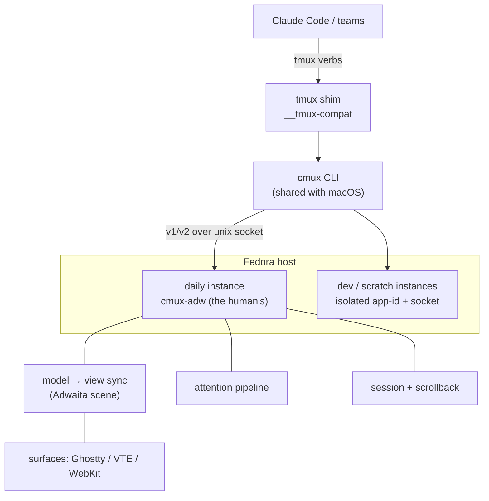

# Wiring atlas — how the cmux Linux port is actually connected

A component-level map of the port, for both of us: the diagrams read
straight from the code, and give the human a picture that prose can't.
Sibling to the conceptual docs — [MENTAL-MODEL.md](../MENTAL-MODEL.md)
is *what cmux is*; this is *how our port is wired inside*.

**How to read / iterate (the collaboration loop).** Served locally with
cmux's own vendored mermaid — no CDN, works on any network:

```sh
linux/scripts/wiring-serve.sh          # prints the URL
# then, in a scratch workspace (never the human's view):
cmux new-workspace --cwd ~/cmux --background
cmux browser open "<url>" --workspace <that workspace>
```

The viewer **live-reloads**: edit any `docs/linux-port/wiring/*.md`, the
open page re-renders the changed doc in ~1.5s. So the agent edits a
diagram, the human watches it change in the browser pane and comments,
the agent iterates — a real two-way loop over the same picture.

Source of truth is the markdown: `mermaid` fenced blocks, so these
render identically on GitHub, in Claude artifacts, and in palma's
viewer — the local viewer just adds the live loop.

## The map at a glance



## Pages

- **② Instance topology** — daily vs dev vs scratch, app-ids, sockets, who-may-kill-whom.
- **③ claude-teams / tmux shim** — the redirect chain, fake `TMUX`/`TMUX_PANE`, teammate → split.
- **④ Control protocol** — CLI resolves handles, frames v1/v2, the server dispatches; capabilities sweep.
- **⑤ Surface lifecycle** — the model, the Adwaita re-render, the registry, reconcile, three backends.
- **⑥ Attention pipeline** — sources → store → tiers (flash/ring/badge) → desktop, suppression funnel.
- **⑦ Session & scrollback** — what persists, the exit save, out-of-band scrollback, replay-on-restore.
- **⑧ Browser stack** — URL bar, automation barrier, profiles, inspector-as-pane.
- **⑨ Build → scratch → promote** — swift build, the tagged/scratch instances, the promote checkpoint.

## Conventions in these diagrams

- **Solid arrow** = a direct call / data flow. **Dashed** = "triggers / observes".
- A box named `like_this` is usually a Swift type or a socket method; prose names the file.
- Colored subgraphs group by process boundary (a different OS process) unless noted.
- Where a thing is macOS-shared vs Linux-only, the node says so — the port's
  whole discipline is *shared code builds on both, Linux code is `#if os(Linux)`*.
